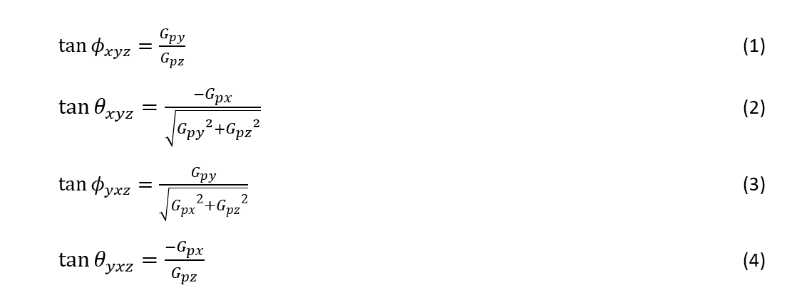
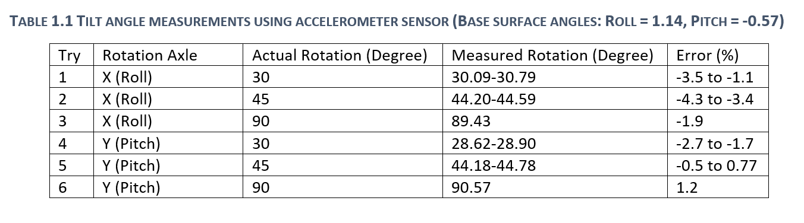
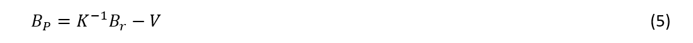
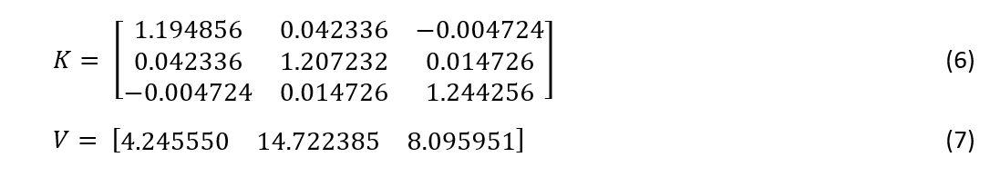
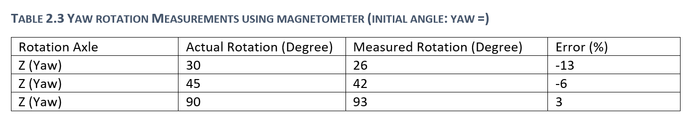

# Arduino Board Orientation Detection Using Accelerometer and Magnetometer
To obtain the orientation of the IoT board, readings from accelerometer and magnetometer are used. With the info receiving from accelerometer, it is only possible to calculate rotation angles pitch and roll and to calculate yaw the magnetometer readings were used. Magnetometer has been calibrated to compensate for soft-iron and hard-iron errors. 

# 1. Using Accelerometer to find tilt angles
Three-Axis accelerometers in IMU is able to sense local gravitational field and movement acceleration. First of all, we find the orientation of sensor reference coordinate system, then we determine tilt angles θ (pitch) and ∅ (roll) as shown in figure below.

Accelerometer measurement in the absence of linear acceleration is used to determine pitch and roll orientation of the MacIOT borad (Pedley, 2013). The order in which rotation applies affects the formulas used to calculate the orientation angles. The most common rotation sequence used in aerospace is the sequence of yaw, pitch, roll rotation. 

Equations (1) and (2) defines the Roll and Pitch rotation for the sequence of rotation roll, pitch, yaw and Equations (3) and (4) determines the angles when rotation is applied in Pitch, Roll, Yaw order. Parameter G_p represents the local gravitational field in IMU reference coordinate system (Pedley, 2013). As we can see, there are regions which these equations are instable but for simplicity we don’t address this issue yet. Since we can have infinite number of answers for equations (1) to (4), we need to restrict either pitch or roll not both of them to lie in the range of -90° to +90° in order to find a unique answer. The function atan2 is used to find the pitch and roll angles which automatically finds out the correct quadrant for the answer.
 
Table ‎1.1 includes experimental data from measuring the orientation angle using the accelerometer. As we can see there is a deviation between measured orientation and actual value. Based on (Tan & Park, 2002),sources  of error in determining the location and orientation using accelerometer sensors are configuration (or misalignment) errors and errors embedded in the sensor itself. In MEMS accelerometer, the source of errors are scale factor error, bias, and noise. Operator error in this measurement is high and contributes a lot to error.

# 2	Magnetometer
In this section, 3-Axis magnetometer sensor integrated in IMU sensor is used to determine the heading angle. Knowing the heading angle, Yaw rotation can be determined meaning that we are able to fully define the orientation of MaCIOT board using data from accelerometer and magnetometer.
## 2.1	Principles and Applications of Magnetometers
There are many different types of magnetic sensors such as Hall sensors, semiconducting magneto-resistors, ferromagnetic magneto-resistors, fluxgate sensors and so on. According to physical principles of magnetometers, they are classified into three categories: induction magnetometers (work based on Faraday’s electromagnetic induction law), magneto-resistive magnetometer (based on the fact that current in the magnetic field can generate a Lorentz force), magnetooptical Magnetometers, and superconducting quantum interference devices (SQUID) (You, 2018).
Each type of sensor has its own specific approach to determine the magnetic field. In Hall sensors, magnetic field is measured from an output voltage proportionate to strength of magnetic field. Magneto-resistive devices measurement is based on electrical resistance. Flux gate sensors measures magnetic fields based on the response of an internally created magnate in the presence of magnetic field (Ripka & Arafat, 2019). Table ‎2.1Illustrates an overview of the basics of working principles of common types of magnetometers. In the following, typical magnetic sensors of Coiled and Hall Effect are briefly explained.

Figure below shows the sensitive range of different types of magnetometers.

### 2.1.1	Coiled
Sensors using coils to determine magnetic flux, as shown in Figure ‎2.2, works based on the induced electromotive force or induced current resulting from change in the magnetic flux intensity received by the coil. This method can determine the changes in magnetic flux (AKM, n.d.).

### 2.1.2	Hall sensors
Hall effect sensors are the most common sensors to measure magnetic flux. As shown in Figure ‎2.3, current is passed through a thin conductive plate which in the presence of a magnetic field, due to a force called Lawrence Force, charges will be diverted from straight line in the plate so electrons move to one side of the plate and positive charges move to the other side. Due to this, an electric voltage is created between two sides of the plate which its intensity is proportionate to the magnitude of magnetic field. Hall-based sensors are able to measure even static magnetic flux density (AKM, n.d.). 

## 2.2	Applications of Magnetometers
Table ‎2.2 illustrates the different applications of magnetometers in three categories based on their sensitivity.

## 2.3	Geomagnetic field
The magnetic field of the Earth functions like a dipole bar magnet as shown in Figure ‎2.4. Characteristics of this magnetic field on any locations around the Earth can be defined with three features of declination, inclination, and intensity. Declination is defined as the angle between magnetic north direction on a compass and the true geographic north which its value varies with location and passage of time. Inclination angle on the other hand, is the angle between magnetic field direction and horizontal plane tangent to the Earth’s surface in a specific geographic location. This angle varies from +90° at the magnetic north pole to -90° at the magnetic south pole which near the Equator this angle approaches zero degree. The highest value of magnetic field of the Earth varies between 25 mG at the Equator to 60 mG at the magnetic poles. This intensity is independent of weather, temperature and time of the day around the Earth and this feature makes it suitable for navigation purposes.

## 2.4	Calibration of magnetometer 
Magnetic field plays an important role in navigation systems. In aeronautical applications such as unmanned aerial vehicle (UAV), magnetic sensors are able to find yaw angle based on the direction of magnetic field. Electronic magnetic sensors (e-compass) are small, low cost, very effective and with no cumulative error. These sensors need to be calibrated to compensate for the errors coming from the sensor itself (sensor zero deviation, scale-factor error, horizontal axis sensitivity), hard iron error, and soft iron error. Errors embedded in the sensor are calibrated y the manufacturer before leaving the factory. Hard iron error is the deviation caused by surrounding materials that creates static magnetic field while soft iron error comes from nearby ferromagnetic objects (Wu, Pei, Li, Gao, & Ba, 2020). Figure ‎2.5 depicts the soft-iron and hard-iron error in magnetic sensor measurements. 

Equation 5 indicates the relation between the output measured by magnetometer (B_P) and ideal output of the magnetometer (B_r) which is basically a transformation from of non-calibrated readings space into ideal reading space. Matrix V accounts for hard-iron error and Matrix K represents the soft-iron error (Wu, Pei, Li, Gao, & Ba, 2020).

As shown in Figure ‎2.5, the ideal magnetometer polar plot in XY plane is a circle with the radius equal to intensity of the Earth’s magnetic field in geographic location of the sensor. So, with knowing the intensity of magnetic field from NOAA (National Oceanic and Atmospheric Administration) we already know the coordinates of our XYZ magnetic sphere. Now, we need to use an algorithm (e.g. L-M algorithm, Newton method, steepest descent method) to map the ellipsoid from magnetometer’s reading into sphere magnetometer space to eliminate the soft-iron and hard-iron errors. 
In this lab assignment, from “www.sailboatinstruments.blogspot.com” a software called “Magneto” is used to acquire matrix V and K. Input parameters to this software are norm of magnetic field in my location which is calculated from NOAA website and is equal with 53.5876 mG, and raw magnetic data readings from the sensor which is saved in acquired using “log-mag-readings.py” code from Github (Wrona, 2021). K and V matrix are as follows:

From Eq. 5,6,7, and magnetometer readings, the real magnetic field vector (B_r)  can be determined.

## 2.5 Determining heading angle using a magnetometer
In order to find a tilt compensated heading angle (yaw ψ), rotations of pitch and roll of the sensor relative to its initial orientation need to be taken into account. Initial reference frame is considered to be: XY plane in horizontal level with X axis inline with horizontal projection of the Rath’s magnetic field, and Z axis is positive in the direction of pointing downward align with gravitation force. So, the rotation angles pitch, roll, and yaw are calculated relative to this global reference frame as shown in Figure ‎2.6. 

In the initial state pitch, yaw and roll are equal with zero and accelerometer and magnetometer readings are as Eqs. 8 and 9.

After rotations R_x (ϕ),R_y (θ),R_z (ψ) around X, Y, and Z respectively, real magnetic field B_r, and accelerometer readings G_p are described by equations below:

Since we already know the calibrated values B_r from Eq. 5, Equations 10 and 11 can be solved to find the rotation angles.

In this report hard iron compensated equation as described in (Ozyagcilar, 2012) with following consideration has been used and put into examination.
	(Ozyagcilar, 2012) only mentioned the hard-iron term in its calculation and there was no information about soft-iron error correction term. So, ideal values of magnetic field B_r were calculated separately and then substituted into equations of rotation angles from (Ozyagcilar, 2012). 
	The hard-iron correction vector in this equation has been considered zero because error compensated values of magnetic field B_r are being used.
The result of the code for different angles are as Table ‎2.3. Operator error in this measurement is high and contributes a lot to error.

## 2.6	Code Structure
Figure ‎2.7 illustrates the algorithm for calculating the orientation of the board.

# References

ADI EngineerZone. (2012). FAQ: Hard & Soft Iron Correction for Magnetometer Measurements. Retrieved from ADI EngineerZone Support Community : https://ez.analog.com/mems/w/documents/4493/faq-hard-soft-iron-correction-for-magnetometer-measurements

AKM. (n.d.). Basic Knowledge of Magnetic Sensor. Retrieved from akm.com: https://www.akm.com/eu/en/technology/technical-tutorial/basic-knowledge-magnetic-sensor/magnetic-sensor/

Balay, S. D. (2018). Cryptochrome Expression in the Zebrafish Retina: Potential Implications for Magnetoreception. Researchgate.

Ozyagcilar, T. (2012). Implementing a Tilt-Compensated eCompass using Accelerometer and Magnetometer Sensors. Freescale Semiconductor.

Pedley, M. (2013). Tilt Sensing Using a Three-Axis Accelerometer. Freescale Semiconductor.

Ripka, P., & Arafat, M. (2019). Magnetic Sensors: Principles and Applications. In Reference Module in Materials Science and Materials Engineering. Elsevier.

Tan, C.-W., & Park, S. (2002). Design and Error Analysis of Accelerometer-Based Inertial Navigation Systems. Berekely: California Path Program.

Wrona, M. (2021, Jan 15). Magnetometer Errors and Calibration. Retrieved from www.youtube.com: https://www.youtube.com/watch?v=MinV5V1ioWg&list=PLEVCP65UJlEkgmG_ijB20E6aG22jEkvOQ&index=5

Wu, H., Pei, X., Li, J., Gao, H., & Ba, Y. (2020). An improved magnetometer calibration and compensation method based on Levenberg–Marquardt algorithm for multi-rotor unmanned aerial vehicle. Measurement and Control.

You, Z. (2018). Space Microsystems and Micro/nano Satellites. Beijing, China: Elsevier.

